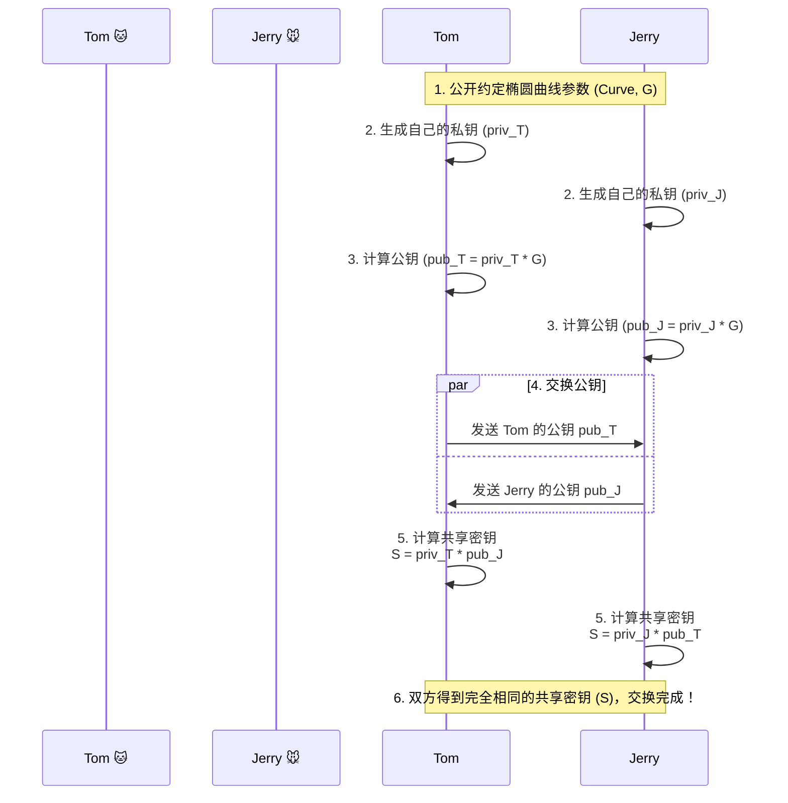

```mermaid
sequenceDiagram
    participant Tom 🐱
    participant Jerry 🐭

    Note over Tom, Jerry: 1. 公开约定椭圆曲线参数 (Curve, G)

    Tom->>Tom: 2. 生成自己的私钥 (priv_T)
    Jerry->>Jerry: 2. 生成自己的私钥 (priv_J)

    Tom->>Tom: 3. 计算公钥 (pub_T = priv_T * G)
    Jerry->>Jerry: 3. 计算公钥 (pub_J = priv_J * G)

    par 4. 交换公钥
        Tom->>Jerry: 发送 Tom 的公钥 pub_T
    and
        Jerry->>Tom: 发送 Jerry 的公钥 pub_J
    end

    Tom->>Tom: 5. 计算共享密钥<br/>S = priv_T * pub_J
    Jerry->>Jerry: 5. 计算共享密钥<br/>S = priv_J * pub_T

    Note over Tom, Jerry: 6. 双方得到完全相同的共享密钥 (S)，交换完成！
```
